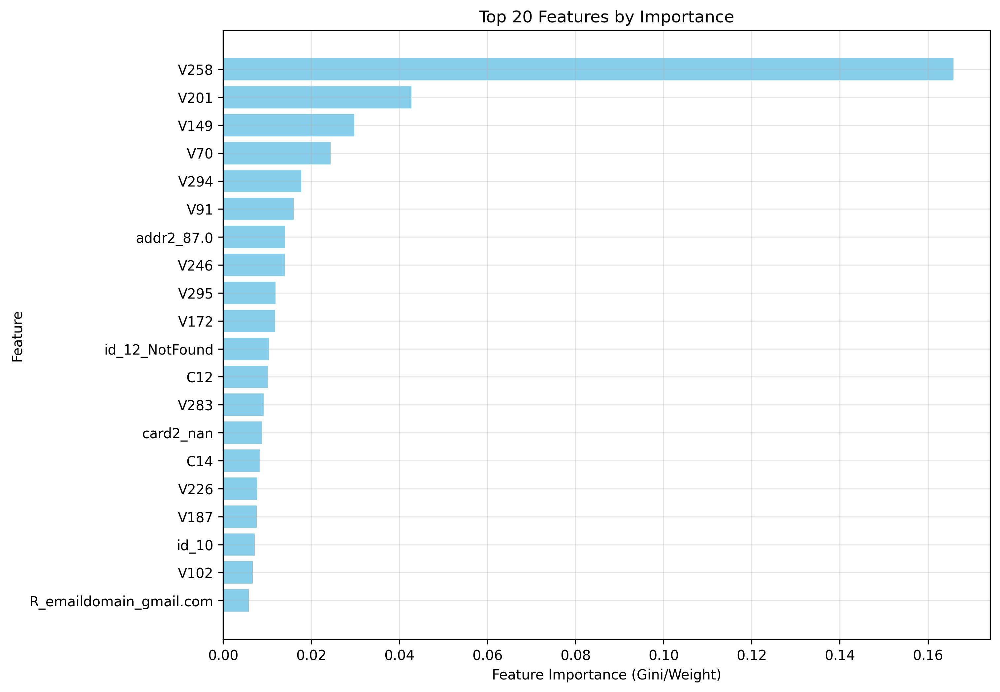
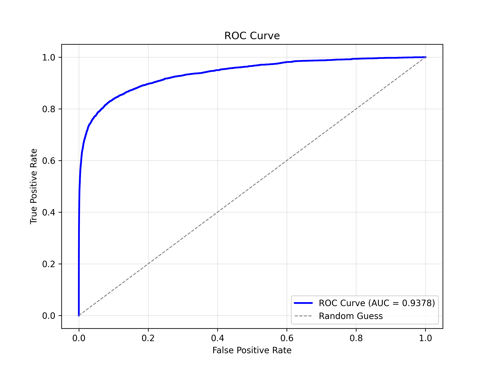

# IEEE-CIS Fraud Detection in Online Payments

## Introduction
This program is designed for the
[IEEE-CIS Fraud Detection](https://www.kaggle.com/competitions/ieee-fraud-detection/) competition on Kaggle.
The challenge is to predict the probability that an online transaction is fraudulent, 
based on a large-scale dataset of transactions from a leading online payment processing company.
I implemented the program in a single Python script (`main.py`) for ease of automatic conversion to a 
Jupyter notebook for submission to the Kaggle competition.

## Approach
This program contains a pipeline to handle feature processing, model training and evaluation, selection 
of the best model, visualization of the model performance, and generation of predictions in the format specified 
by Kaggle.

### Feature processing
- **One-hot encoding**: Categorical features are one-hot encoded for categories present in the training set above a certain frequency threshold.
- **Z-scaling**: All features are z-scaled to improve performance and convergence of the machine learning algorithms.
- **Imputing missing values**: Missing values are imputed with mean values since not all model types can handle missing data natively.

### Models used
I experimented with two types of 
machine learning models:
- **Binomial Logistic 
  Regression** using 
  LogisticRegression from `sklearn` 
- **Gradiented-boosted decision 
  trees** using XGBoostClassifier from 
  `xgboost` 

### Evaluating model performance
This program evaluates and compares the area under the ROC curve for models whose name and parameters 
are manually specified in a list passed into the `main_model_evaluation` function, and it selects the model 
with the best score to generate the final predictions for Kaggle.
The best model so far was an XGBoostClassifier with parameters {'n_estimators': 32, 'max_depth': 8},
whose area under the ROC curve for this program's validation set was **0.9353**.

## Visualizations

### Feature Importance Plot 

This plot highlights which features had the biggest impact on the model's 
predictions. These most important features could be selected to train a neural network in a later stage.

### ROC Curve

Receiver Operating Characteristic (ROC) curve for the best model with an Area Under the Curve (AUC) of 0.9353, 
indicating strong model performance in distinguishing between classes.

### Confusion Matrix

This plot displays how well the model fraudulent transactions by comparing the true vs. predicted classes.

## Next steps
This program could still be improved by:
* More sophisticated feature engineering and selection and smarter handling of missing data
* Trying additional types of machine learning models, including neural networks
* Exploring the effects of varying model parameters more systematically with a grid search
* Implementing cross-validation to better assess model generalization and prevent overfitting to the validation set
