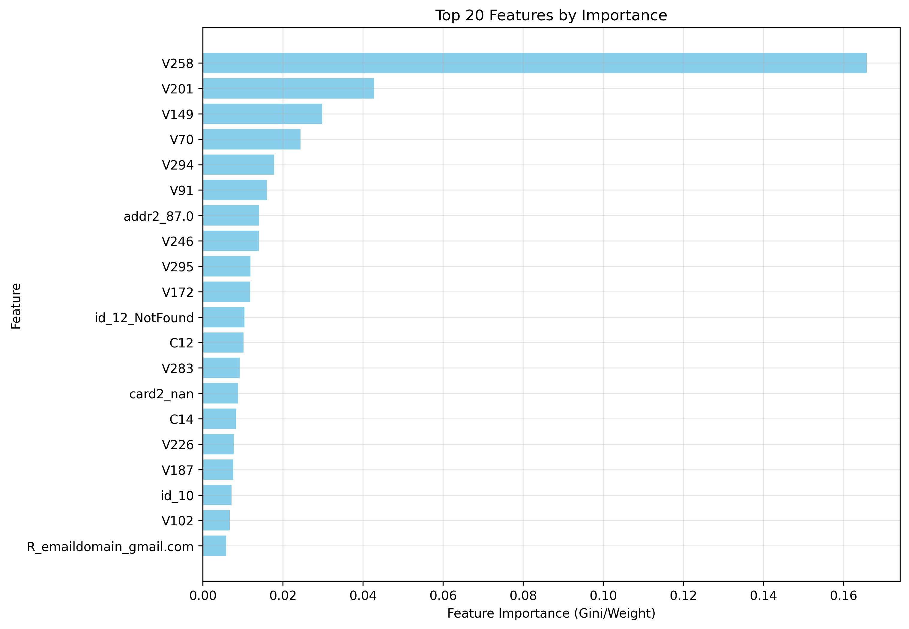
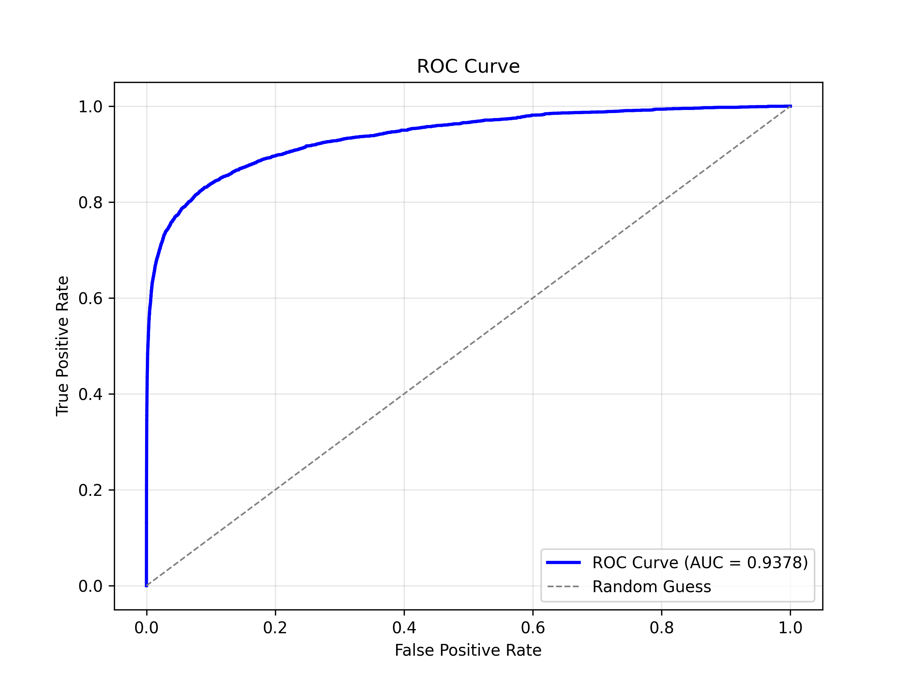
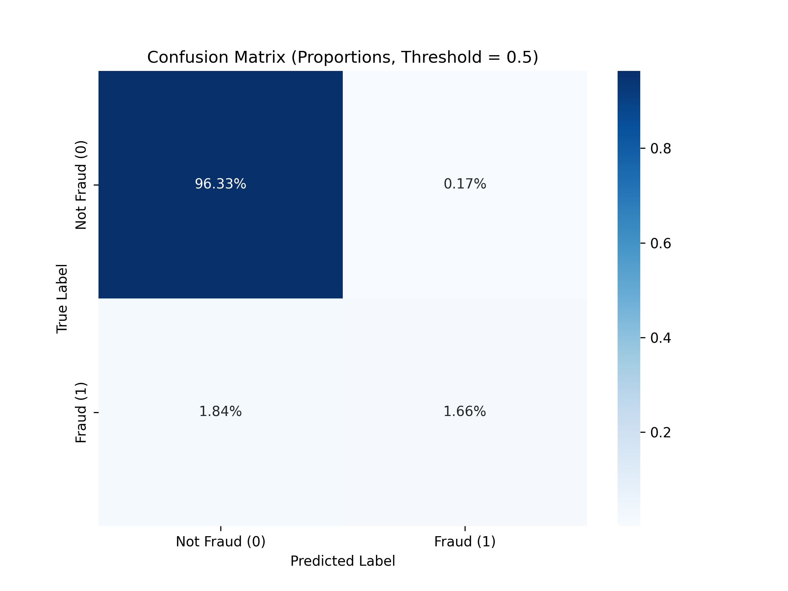

# IEEE-CIS Fraud Detection in Online Payments

## Introduction
This program is inspired by the
[IEEE-CIS Fraud Detection](https://www.kaggle.com/competitions/ieee-fraud-detection/) competition on Kaggle.
The challenge is to predict the probability that an online transaction is fraudulent, 
based on a large-scale dataset of transactions from a leading online payment processing 
company.

## Approach
This program contains a pipeline to handle feature processing, model training and evaluation, visualization of 
model performance, and selection of the best model.

### Feature processing
- **One-hot encoding**: Categorical features are one-hot encoded for categories present in the training set above a certain frequency threshold.
- **Z-scaling**: All features are z-scaled to improve performance and convergence of the machine learning algorithms.
- **Imputing missing values**: Missing values are imputed with mean values since not all model types can handle missing data natively.

### Models used
I experimented with three classes of 
machine learning models:
- **Binomial logistic 
  regression** using 
  LogisticRegression from `sklearn` 
- **Gradiented-boosted decision 
  trees** using XGBoostClassifier from 
  `xgboost` 
- **Neural networks** using `tensorflow.keras`

### Evaluating model performance
This program evaluates and compares the area under the ROC curve for models whose name and parameters 
are manually specified in a list passed into the `main_model_evaluation` function, and it identifies the model 
with the best score.
The best model so far was an XGBoostClassifier with parameters {'n_estimators': 32, 'max_depth': 8},
whose area under the ROC curve for this program's validation set was **0.9378**.

## Visualizations

### Feature Importance Plot 

This plot identifies the features that had the greatest influence on the best-performing model’s (XGBoost) predictions. 
By focusing on these top features, the dataset can be simplified to potentially improve the performance of more complex
models, such as neural networks, by reducing noise and computational requirements.

### ROC Curve

Receiver Operating Characteristic (ROC) curve for the best model with an Area Under the Curve (AUC) of 0.9378.

### Confusion Matrix

This plot displays how well the model fraudulent transactions by comparing the true vs. predicted classes.

## Next steps
This program could still be improved by:
* More sophisticated feature engineering and selection and smarter handling of missing data
* Exploring the effects of varying model parameters more systematically with a grid search
* Implementing cross-validation to better assess model generalization and prevent overfitting to the training set
